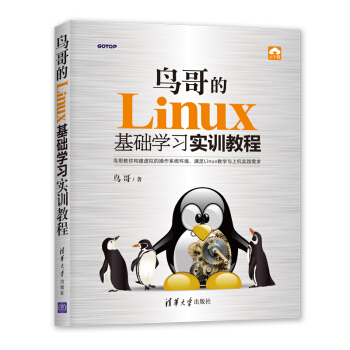

鸟哥的Linux基础学习实训教程 参考答案
===
### 非官方答案，正在更新中，欢迎提交你的答案～

写在前面的话：自己最近学习linux相关知识，恰好鸟哥出了一本新书《鸟哥的linux基础学习实训教程》，看了几章觉得很不错（比私房菜薄很多了~！！），美中不足是题目没有答案，我想既然没有，那就自己写一套吧，于是我将自己做的作业总结在这里，由于自己也是初学者，答案会有遗漏出错或者歧义，仅供参考，欢迎和我随时讨论~

[在线免费阅读鸟哥官方电子书](http://linux.vbird.org/linux_basic_train/)
ISBN：9787302510826

[鸟哥官方linux环境本地安装教程.pdf](鸟哥官方linux环境本地安装教程.pdf) [CentOS镜像百度云盘转存地址，密码4sq9](https://pan.baidu.com/s/1xqdwCEL3aVgW4dWrnwL1NA )

### 第一章 初次使用Linux与命令行模式初探
[习题答案](./chapter1/answers.md)

### 第二章 命令的执行与基本的文件管理
[习题答案](./chapter2/answers.md)

### 第三章 文件管理与vim初探

[习题答案](./chapter3/answers.md)  更新中

### 第四章 Linux文件的权限与账号管理
未更新

### 第五章 权限的应用、进程的查看与基本管理

[习题答案](./chapter5/answers.md)

### 第六章 文件系统的基本管理

[习题答案](./chapter6/answers.md) 

### 第七章 bash的基本使用与系统救援
[习题答案](./chapter7/answers.md)

### 第八章 bash命令连续执行与数据流重定向
[习题答案](./chapter8/answers.md)
