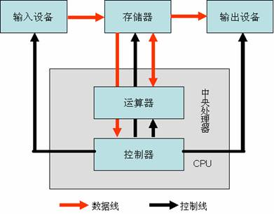

# Chapter1 初次使用Linux与命令行模式初探
## p2
###1. 一般计算机硬件系统组成的五大单元
分别是输入设备、输出设备、存储器、控制器和运算器，其中存储器、控制器和运算器是主机部分的三大单元

作用分别是：

<table>
<tr><td>控制器 </td><td>控制器是对输入的指令进行分析，并统一控制计算机的各个部件完成一定任务的部件 </td></tr>
<tr><td>运算器 </td><td>运算器的主要作用是执行各种算术运算和逻辑运算，对数据进行加工处理 </td></tr>
<tr><td>存储器 </td><td>存储器是计算机记忆或暂存数据的部件 </td></tr>
</table>

### 2. 标出五大部件的连接图
（如上图所示）

### 3. 哪个部件对服务器比较重要
一般来说，服务器对：存储器中内存，输（入）出设备中的网卡，中央处理器CPU等要求较高，而对于输出设备中显示器等设备要求不高，但是随着现在人工智能的快速发展，深度学习方法需要训练和测试需要占用大量GPU显存，这种情况下，对于显卡的要求也是很高的。

## p3
### vista的不兼容一些xp软件
vista相比xp，重写了内核

### 为何软件会告知用户适用的操作系统
操作系统是处于应用程序和硬件之间的桥梁，而应用程序正是通过这个”桥梁“能够方便使用到计算机的资源，应用程序必须要基于特定的操作系统进行开发，最后交付给用户时候，也会告知用户相适用的操作系统（如windows、mac、linux等）

## p6
### I/O与CPU分离运行的操作系统
线代操作系统基本都支持I/O与CPU分离运行，可以通过DMA技术（内存直接存取技术），DMA方式能使I/O设备直接和存储器进行成批数据的快速传送，从而减轻CPU的负载，读者想知道更详细过程，可见[参考1](https://zh.wikipedia.org/wiki/%E7%9B%B4%E6%8E%A5%E8%A8%98%E6%86%B6%E9%AB%94%E5%AD%98%E5%8F%96#%E7%9B%B4%E6%8E%A5%E8%A8%98%E6%86%B6%E9%AB%94%E5%AD%98%E5%8F%96)

### 最纯种的UNIX两套
被称为纯种的Unix指的是System V以及BSD这两套

### GNU
1. 名称：GNU is Not Unix
2. 官网：http://www.gnu.org/
3. 吉祥物：（见下面）
4. 内核名称：GNU Linux-libre

## p7
### GPL还是BSD
使用GPL，GPL协议具有集成性，禁止其它人的商业用途而且每次基于源码开发后必须要再次开源。

## p8
### Android的Linux内核
安卓的长期维护版的内核：第一个 LTS 内核 (2.6.16) 在 2006 年诞生。从那时起，每年都会选择一个新的 LTS 内核，并且内核社区会为该内核提供最少 2 年的维护支持。在撰写本文之时，LTS 内核版本为 4.4.y、4.9.y 和 4.14.y，并且每周发布一个新内核。为了满足某些用户和发行方的需求，内核开发者会额外维护一些较旧的内核，但会延长发布周期。如需有关所有长期稳定内核、内核负责方以及维护时长的信息。

内核可见：[android官网](https://source.android.com/devices/architecture/kernel/releases)

### 现阶段的Linux内核

mainline:	4.20-rc2

stable:	4.19.2

longterm:	4.14.81

（注意：以上信息可能会出现更新）

官网见：[Linux内核](https://www.kernel.org/)

## p9
### 为什么CentOS基于RHEL发布？法律保护？
CentOS虽然取自Red Hat的RHEL操作系统，但是已经将源代码中Red Hat注册商标或其它著作相关的信息系删除了，改以社区企业操作系统为名再次发行。

### Top500
1. 网址是：https://www.top500.org/
2. 通过最大的浮点数计算速度衡量，单位：TFlops/s,可以简单写为T/s, 是数据流量的计数单位,意思是”1万亿次浮点指令每秒”
3. 内核数：2,397,824个
4. 143,500.0 TFlops/s
4. 当前为9783kv，一天需要9783\*24*0.5 = 117396元

### Dell linux support
网址是：http://linux.dell.com/files/supportmatrix/
查询的意义在于，可以了解dell硬件可以支持哪些linux发行版，从而更好发挥系统的性能。

## p20
### 1.(重复，略)
### 2.台式机和手机的CPU类型
台式机：x86架构，以Intel和AMD为主
手机：ARM架构，以ARM公司为主，包括华为麒麟也是这种架构
### 3.判断所属层次
Linux属于操作系统，x86个人计算机属于硬件，POSIX属于系统调用，open office属于应用程序层
### 4. 肯·汤普逊（Tompson）
### 5.Tompson 和 Ritchie
### 6.SystemV
### 7.Richard Matthew Stallman，GPL
### 8.Minix
### 9.GPL、BSD、Apache、MIT等
### 10.内核、软件、工具和可完全安装程序
### 11.基于Debian发行版
### 12.CTRL+ALT+F2————F6
### 13.EXIT 或CTRL+D
### 14.ls -a
### 15.history
### 16.poweroff 或shutdown -h now 或halt
### 17.找出特定的隐藏文件
 > ls .* 
 
 > 列出所有的隐层文件
 
 > ls .* | grep ".hidden.txt" 
 
 > 打印出特定的隐藏文件，我这里隐藏文件是.hidden.txt