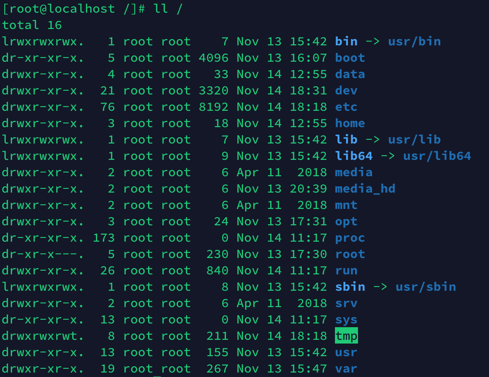
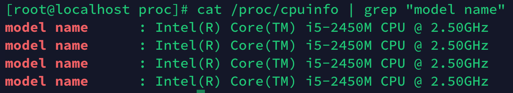
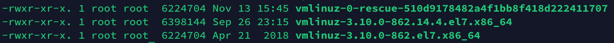
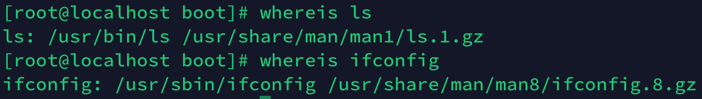

# Chapter2 命令的执行与基本的文件管理
## p34
### 1. 使用ls /命令，可见如下：

可见链接目录有后面出现一个小箭头，指向链接到的目录，常规目录没有此小箭头。

### 2. /prop和/sys文件大小都是0,都是虚拟内存系统，用于导出硬件信息

/prop不同于一般的文件，是一种虚拟文件系统（A Virtual File System），用于存储与内核信息有关的特殊文件，通过这个文件夹我们可以获取一系列与硬件相关的丰富信息和正在运行的任何进程。
比如说，我们可以以下命令查看cpu的信息：

 > cat /proc/cpuinfo | grep "model name" 
 
 
 /sys是 Linux 内核中设计较新的一种虚拟的基于内存的文件系统，它的作用与proc有些类似,相比于proc文件系统，使用sysfs
导出内核数据的方式更为统一，并且组织的方式更好.

 参考来源：[1、centos 官方关于proc的介绍](https://www.centos.org/docs/5/html/Deployment_Guide-en-US/ch-proc.html)  [2、prop与sys文件系统的比较](http://www.cnblogs.com/createyuan/p/4326407.html)

### 3. 查看/boot/vmlinuz，大小为6MB
我们进入/boot 然后ll(或者ls -alh可以看到多少MB，更加直观)，如下：

我这里有三个内核，每次开机需要选择，我选择最下面那个（第一个是rescue恢复内核），大小为6.2MB
后面那串数字，即3.10.0-862.el7.x86_64，可用uname -r 打印出来，即：
> 3.10.0-862.14.4.el7.x86_64

### 4. man ls 和man ifconfig分别是查看ls和ifconfig命令帮助文档的文件，通过man可以快速查看这条命令的用法；定位ls和ifconfig可以通过whereis来定位，如：

可见这两个命令都存放在/usr/bin文件夹下，这个文件下存放的是可执行文件

### 5. 我们需要使用内存文件系统，这个文件系统将内存仿真成文件系统，具体路径在/dev/shm,其默认大小为内存的一半，和内存断电丢失所有数据一样，重启系统后，其内容会自动被清空，适合临时且快速访问的应用场景。

 参考资料：[内存文件系统介绍](https://blog.csdn.net/gdutliuyun827/article/details/17280069)
 
## p36
### 1. 	先cd过去再打印即可；

	> cd /var/spool/mail/
### 2. 查看上一层目录的文件信息

	> ls ..
	
### 3. 转到上一层面目录的anacron

	> cd ../anacron/
	
### 4. 当前处于/var/spool/mail下，
	> 相对路径：ls ../../log/
	
	> 绝对路径: ls /var/log/

### 5. 回到自己的根目录： cd ~
### 6. 不同方式执行ifconfig(注意我目前处于/root目录下,不同机器可能结果不一样)
 	> 默认: ifconfig
 	> 相对路径：../usr/sbin/ifconfig
 	> 绝对路径：/usr/sbin/ifconfig
 	> 工作目录下: ifconfig
 	
## p37
### 1. 请按照p36-37 1——6完成，完成后会有的passwd的
### 2. 删除用rm 文件，删除目录下所有文件用rm -r 目录，查看rm用法用：man rm可以查看
### 3. X11是目录
### 4. rm -r /dev/shm/backup/etc/X11
### 5. rm -ri /dev/shm/backup/etc/xdg 会递归该文件夹然后删除相关的文件或文件夹

## p38
### 1. 请按照p36-37 1——6完成，完成后会有的passwd的
### 2. 删除用rm 文件，删除目录下所有文件用rm -r 目录，查看rm用法用：man rm可以查看
### 3. X11是目录
### 4. rm -r /dev/shm/backup/etc/X11
### 5. rm -ri /dev/shm/backup/etc/xdg 会递归该文件夹然后删除相关的文件或文件夹